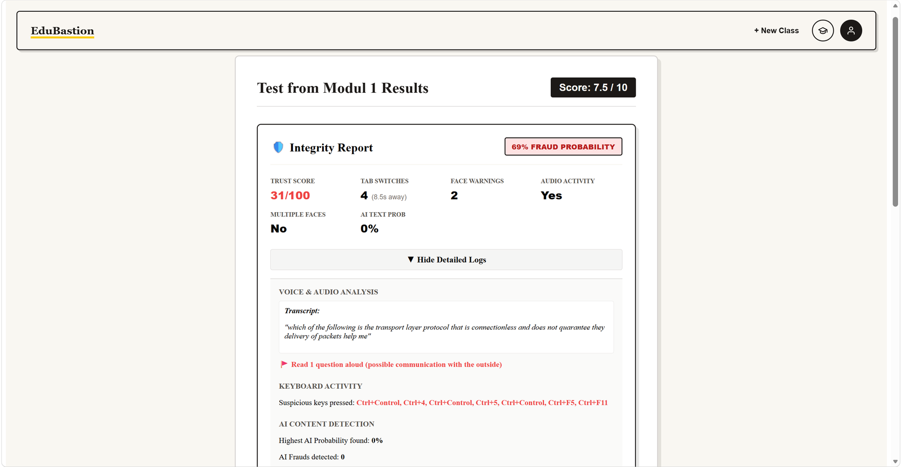
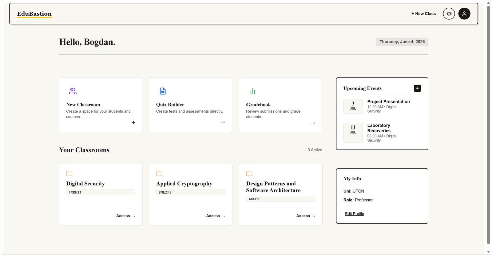
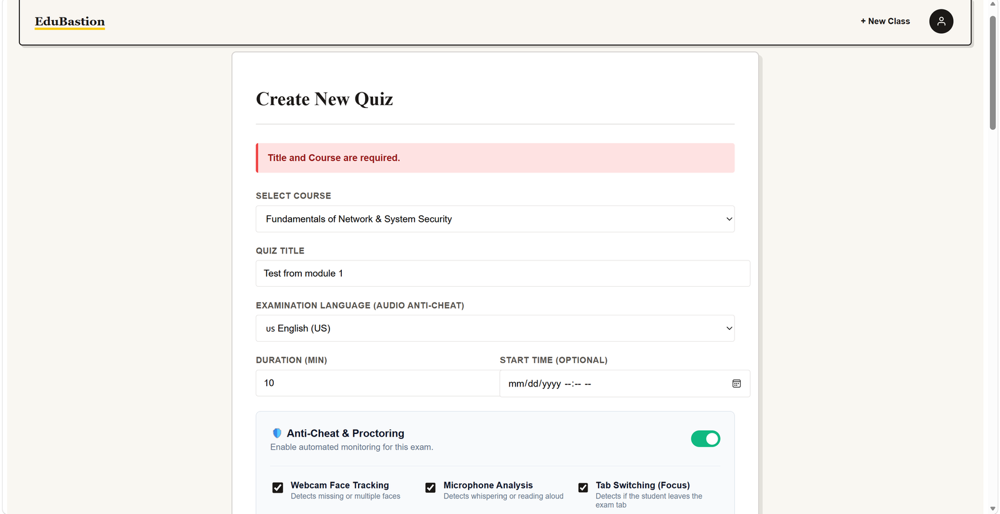
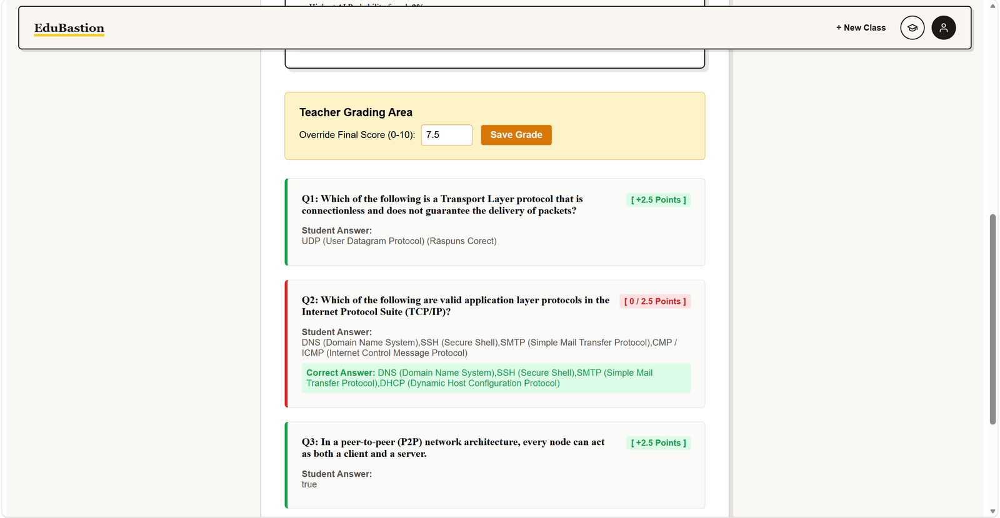
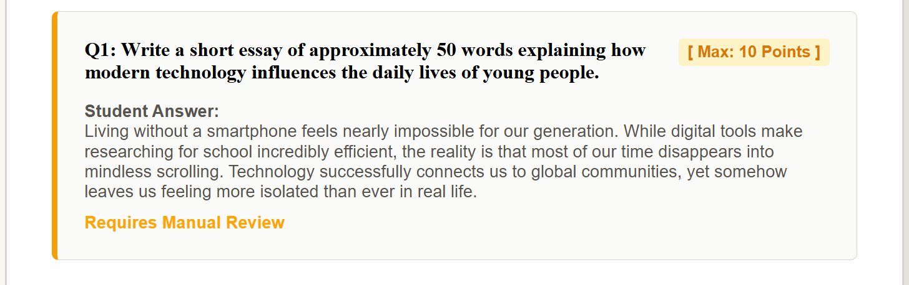
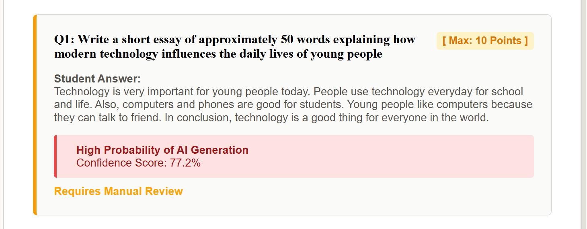

# EduBastion

**An integrated platform for automated student assessment and exam fraud detection.**

Bachelor's thesis project — Technical University of Cluj-Napoca, Faculty of Automation and Computer Science, 2026.
Scientific advisor: Assoc. Prof. Eng. Teodora Sanislav, PhD.

EduBastion runs the full lifecycle of a virtual class — courses, modules, materials, quizzes, automatic grading, gradebook — and layers on a **proctoring engine** that aggregates four independent fraud-detection signals into a single trust score, presented to the professor as decision support rather than as an automated verdict.

---

## The integrity report

What a professor sees after a student submits: every proctoring signal, the events behind it, and the aggregated trust score. Nothing is hidden behind a single verdict.



Here the student left the exam window four times, was off-camera twice, and read a question out loud — captured in the audio transcript. Trust score 31/100.

---

## Screens

**Professor dashboard**



**Test builder** — five question types on a polymorphic model, with per-question scoring



**Submission review** — automatic grading per question, with manual override for essay answers



**Webcam proctoring** — face detection flags an absent student or a second person in frame



**AI text detection on an open-ended answer**



---

## Why this project exists

Online examinations created two problems at once: grading load grew, and the surface for cheating widened — generative AI, second screens, whispered help, people off-camera. Commercial proctoring tools tend to be opaque black boxes that return a binary verdict.

EduBastion takes the opposite position: **every signal is logged, explained, and weighted, and the final decision stays with the professor.** The trust score is an aggregate of interpretable events, not a classifier output.

---

## Architecture

Three-tier, decoupled:

```
┌──────────────┐   REST / JSON    ┌──────────────┐    SQLAlchemy    ┌──────────────┐
│    React     │ ───────────────► │   FastAPI    │ ───────────────► │  PostgreSQL  │
│   (Vite)     │ ◄─────────────── │   backend    │ ◄─────────────── │   (JSONB)    │
└──────────────┘                  └──────────────┘                  └──────────────┘
       │                                  │
       │ webcam frames                    ├── Haar cascade face detection (OpenCV)
       │ audio transcript                 ├── multilingual transcript keyword analysis
       │ browser telemetry                ├── supervised AI-text classifier
       └────────────────────────────────► └── trust-score aggregation
```

Backend layering: `Controllers` (HTTP routing) → `Services` (business logic) → `Models` (Pydantic schemas) / `Database` (SQLAlchemy ORM), with a `Core` package holding the polymorphic question and quiz domain model.

**Scale:** ~13,000 LOC · 58 API endpoints · 16 database tables · 10 controllers · 11 services.

---

## Proctoring engine

| Module | Technique | Detects |
|---|---|---|
| **Webcam** | OpenCV Haar cascade face detection on sampled frames | Student absent from frame; more than one person present |
| **Audio** | Web Speech API transcript + multilingual keyword matching | Spoken requests for help, dictated answers |
| **Browser telemetry** | Fullscreen / visibility / key events | Fullscreen exit, tab switch, blocked keys (F5, F12, Ctrl+V, right click) |
| **AI text** | Supervised RoBERTa detector, run locally | Machine-generated essay answers |

Each event is written to `proctoringlogs` with a timestamp and a penalty weight. The trust score is the aggregate; the professor sees both the score and the full event timeline.

### AI text detection: three attempts and what each measurement showed

This part went through three iterations. The two that were discarded are documented because the measurements are the interesting bit.

**1. GPT-2 perplexity.** The first version scored answers with raw GPT-2 perplexity against a fixed threshold. Two problems. Perplexity conflates *unusual* text with *human* text — an odd prompt produces odd output from a machine too. And it runs systematically low for non-native English speakers, which in a Romanian university is most of the cohort. A detector that disproportionately accuses non-native speakers is worse than no detector.

**2. Binoculars, zero-shot.** [Hans et al., ICML 2024](https://arxiv.org/abs/2401.12070) targets exactly the first problem. Two models sharing a tokenizer — an observer and a performer — with the observer's cross-entropy divided by the cross-entropy between the two models' distributions:

```
score = observer_cross_entropy(text) / cross_entropy(observer, performer)
```

The denominator normalises away the prompt-induced component that single-model perplexity cannot separate.

The paper uses a Falcon-7B pair (~28 GB in bfloat16). That does not fit 16 GB of RAM, so I ran a Qwen3-0.6B pair (~2.5 GB) and calibrated it locally: 36 human samples (drawn from this thesis — academic English by a non-native speaker, the exact population at risk of false accusation) against 16 AI samples of matched length.

| | min | median | max |
|---|---|---|---|
| Human | 0.8044 | 0.8870 | 1.0186 |
| AI | 0.7217 | 0.8251 | 0.9585 |

Class separation **7.0%**. At a threshold of 0.8135, chosen for a 5% target false-positive rate: **2.8% false positives, 37.5% detection** — six in ten AI answers passing undetected.

Two findings worth keeping:

- The published threshold of **0.9015 sits above the human median here**, so applying it unchanged flagged most human text as machine-written. Thresholds do not transfer between model pairs.
- Catching more required raising the threshold to roughly the human median, i.e. accusing about half of honest students. The limit was model capacity, not calibration.

**3. Supervised classifier — the current default.** A RoBERTa model fine-tuned for this task is ~500 MB, scores an answer in 2–3 seconds, and outperforms zero-shot Binoculars at any size that fits this hardware. Zero-shot only wins when you can afford a 7B pair.

Both backends remain in the codebase behind `AI_DETECTOR_METHOD`. The comparison is the point: the supervised model is more accurate today, the zero-shot method ages better as new LLMs appear, since it was never trained on any particular one.

### Other honest limitations

- **The classifier is trained on ChatGPT-era text (HC3, 2023).** Performance degrades on output from newer models. This is the structural weakness of any supervised detector and the reason the zero-shot path is kept.
- **Haar cascades are weak** compared to a CNN detector — partial occlusion, poor lighting and non-frontal faces all defeat them. Chosen for CPU-only real-time performance on student hardware; MediaPipe or MobileNet-SSD would be next.
- **Audio analysis is keyword-based**, so it catches explicit requests for help but not paraphrase.
- **AI text detection stays probabilistic.** No version of this reaches certainty, which is why the score feeds a professor's decision alongside the full event log and never triggers an automatic penalty. The interface reports four distinct states — flagged, uncertain, reads as human, and not analysed — because "we did not check this" and "we checked and it looks fine" are different claims.
- **No adversarial hardening.** A determined student with a second device defeats all four channels. The system raises the cost of casual cheating; it does not claim to prevent determined cheating.

---

## Tech stack

**Backend** — Python 3.12, FastAPI, SQLAlchemy 2.0, Pydantic v2, PostgreSQL (JSONB for polymorphic question payloads), bcrypt, JWT sessions, OpenCV, Hugging Face Transformers, PyTorch

**Frontend** — React 19, Vite 7, React Router 7, CSS Modules

---

## Running it

### With Docker (recommended)

```bash
git clone https://github.com/boddy2021/EduBastion.git
cd EduBastion
cp .env.example .env        # then edit .env with your own values
docker compose up --build
```

Frontend: <http://localhost:5173> · API docs: <http://localhost:8000/documentatie>

### Manually

```bash
# 1. Database
createdb edubastion
psql edubastion < EduBastion_schema_of_PostgreSQL_db.sql

# 2. Backend
python -m venv .venv && source .venv/bin/activate   # Windows: .venv\Scripts\activate
pip install -r requirements.txt
cp .env.example .env                                 # edit it

# --reload-dir keeps the watcher off Frontend/node_modules, which otherwise
# triggers spurious backend restarts.
uvicorn App.main:app --reload --reload-dir App

# 3. Frontend
cd Frontend && npm install && npm run dev
```

First use of AI text detection downloads the classifier (~500 MB) from Hugging Face. It loads in a background thread, so neither startup nor a student's submission ever waits on it.

### Checking and calibrating the detector

Score a single text without going through the UI:

```bash
python scripts/check_text.py --file answer.txt
```

Measure the threshold on your own samples:

```bash
python scripts/calibrate_detector.py --human samples/human --ai samples/ai --fpr 0.05
```

Include answers written by non-native English speakers in the human set — they are the group a badly calibrated threshold punishes, so they are the group the calibration has to see.

---

## Tests

```bash
pip install -r requirements-dev.txt
pytest
```

55 unit tests covering the three areas where a bug is most expensive:

- **Grading rules** (`App/Core/grading.py`) — every question type, plus the edge cases that bite in production: partial checkbox selections, missing or null point values, unknown question types, whitespace and casing in short answers. The rules live in a dependency-free module precisely so they can be tested without a database.
- **Authentication** (`App/security.py`) — bcrypt salting and verification, and the JWT rejection paths that actually matter: forged signatures, tokens signed with a different key, expired sessions, and a student rewriting their own `role` claim to `professor`.
- **Binoculars scoring** (`App/Core/binoculars.py`) — the ratio maths and the score-to-confidence mapping, including that the threshold boundary resolves in the student's favour and that confidence is floored at 50 so a marginal flag never reads as certainty. Model loading is kept out of this module so the tests run in seconds without downloading weights.
- **Detector gating** (`tests/test_detector_gating.py`) — that a quiz created without proctoring never has its essay answers scanned.

CI runs both suites plus the frontend lint and build on every push.

---

## Configuration

All secrets come from environment variables — nothing is committed. See `.env.example`.

| Variable | Purpose |
|---|---|
| `DATABASE_URL` | PostgreSQL connection string |
| `SECRET_KEY` | JWT signing key — generate with `python -c "import secrets;print(secrets.token_urlsafe(48))"` |
| `ACCESS_TOKEN_EXPIRE_MINUTES` | Session lifetime (default 720) |
| `CORS_ORIGINS` | Comma-separated allowed origins |

---

## Project structure

```
App/
├── Controllers/     # FastAPI routers — 58 endpoints across 10 modules
├── Services/        # business logic, incl. ai_detector + voice_analyzer
├── Models/          # Pydantic request/response schemas
├── Core/            # domain logic, dependency-free and unit-tested:
│                    #   polymorphic Question hierarchy, grading rules,
│                    #   Binoculars scoring maths
├── Database/        # SQLAlchemy models, session factory, enums
├── config.py        # environment-driven settings
├── security.py      # bcrypt hashing, JWT issue/verify, role guards
└── main.py          # app factory, CORS, router registration

Frontend/src/
├── pages/           # route-level screens (incl. TakeQuizPage + useProctoring hook)
├── components/      # modals, navbar, shared UI
└── routes/          # role-based routing
```

---

## What I would do differently

An honest list, kept here because the reasoning matters more than the code:

- Replace the hand-rolled JWT implementation with **PyJWT**. Writing HMAC signing by hand was instructive and the rejection paths are tested, but shipping your own crypto is the wrong default.
- Fine-tune the detector on exam answers specifically, instead of using an off-the-shelf checkpoint trained on general web text.
- Swap the polling-based chat for **WebSockets**.
- Replace Haar cascades with a **CNN face detector** (MediaPipe or MobileNet-SSD).
- Calibrate the AI-text threshold **per cohort** rather than using a single global value, and publish the measured false-positive rate to professors alongside each flag.
- Add **Alembic migrations** instead of shipping a raw schema dump.

---

## Roadmap

This project is the starting point for my master's research at the Automation Department (UTCN, 2026–2028) on **decentralized coordination of UAV swarms for search-and-rescue** — carrying the same idea (fusing several uncertain real-time sensing channels into one decision loop) from the software domain into a physical cyber-physical system.

---

## License

MIT
